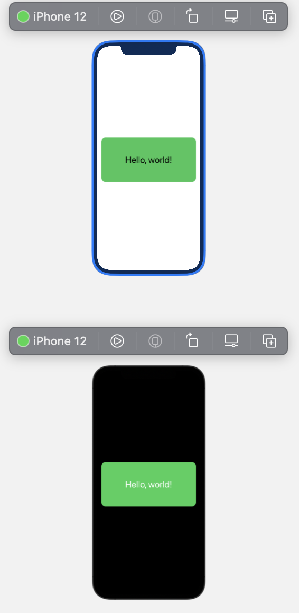

# PreviewDevice

[](https://cocoapods.org/pods/PreviewDevice)


[](https://twitter.com/Toni777772)

## Requirements

* Xcode 13+
* iOS 13.0+, macOS 10.15+, Mac Catalyst 13.0+, tvOS 13.0+, watchOS 6.0+

## Usage 

Example:

```swift
import PreviewDevice

struct ContentView_Previews: PreviewProvider {
    
    static var previews: some View {
        ContentView()
            .previewDevice(device: .iphone13, colorSchemes: ColorScheme.allCases)
    }
}
```

Result 

<div align="left"></div>


### Preview on device

```swift
.previewDevice(device: .iphone12)
```


### Preview on devices

```swift
.previewDevices(device: [.iphone8, .iphone11Pro .iphone12, .iphone12ProMax])
```

### Preview on device with color scheme (light, dark)

```swift
.previewDevice(device: .iphone12, colorScheme: .light)
```

### Preview on device with ColorSchemes

```swift
.previewDevice(device: .iphone12, colorScheme: [.light, .dark])
```

### Preview on device with orientation (InterfaceOrientation)

```swift
.previewDevice(device: .iphone12, orientation: .portrait)
```

### Preview on device with orientations

```swift
.previewDevice(device: .iphone12, orientations: [.portrait, .landscapeLeft, .landscapeRight])
```

### Preview on device with orientation and color schemes

```swift
.previewDevice(device: .iphone12, orientation: .portrait, colorSchemes: [.light, .dark])
```

## Installation

### [CocoaPods](https://guides.cocoapods.org/using/using-cocoapods.html)
Specify next line in Podfile:

```ruby
pod PreviewDevice
```

### [Swift Package Manager](https://github.com/apple/swift-package-manager)

Open Xcode, File -> Swift Packages -> Add Packages.. and paste library git url:

```
https://github.com/Toni77777/PreviewDevice.git
```

## Articles 
[Meet PreviewDevice 0.7.0](https://dev.to/toni777772/meet-previewdevice-0-7-0-1dpg) 

[What's new in PreviewDevice 0.8.0](https://dev.to/toni777772/what-s-new-in-previewdevice-0-8-0-5dc0) 

## License
PreviewDevice is released under the MIT license.
